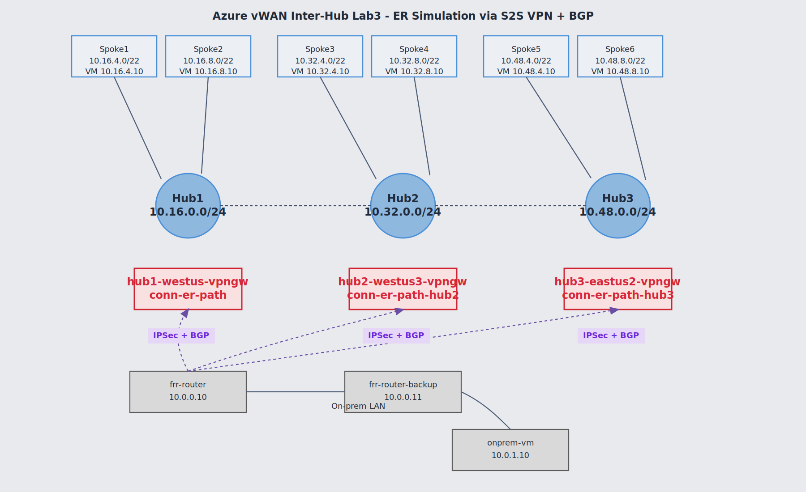
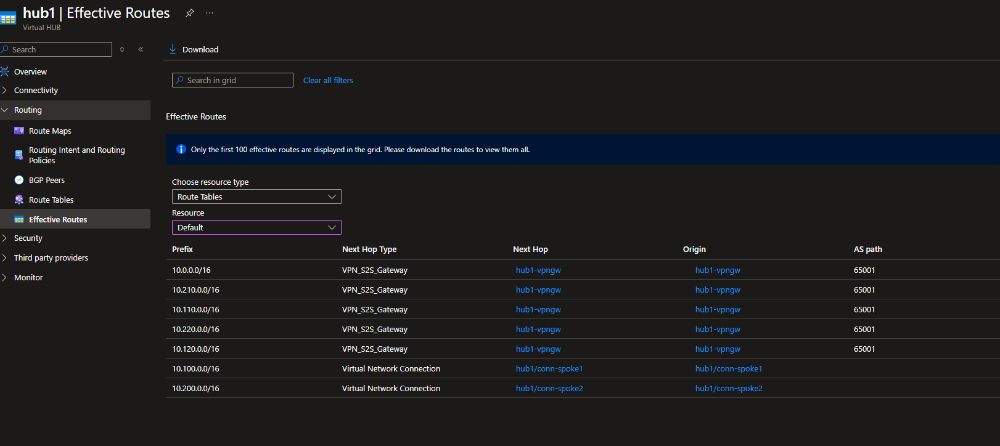
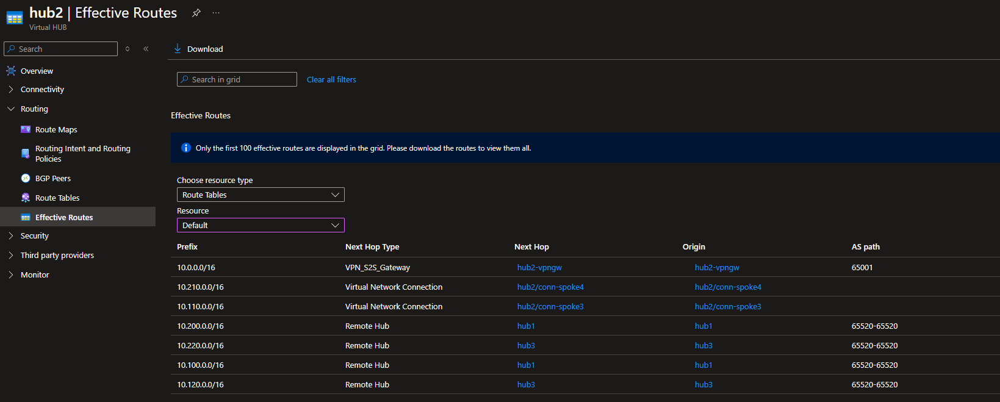
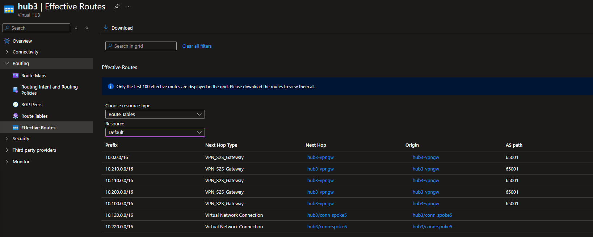
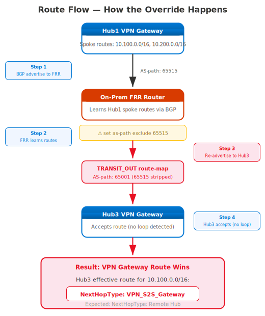

# Azure vWAN BGP Inter-Hub Routing Lab

## Table of Contents

- [TL;DR](#tldr)
- [Architecture Overview](#architecture-overview)
- [Real-World Causes](#real-world-causes)
- [Problem Statement](#problem-statement)
- [Root Cause](#root-cause)
- [Mitigation Options](#mitigation-options)
- [Why Two VMs?](#why-two-vms)
- [Prerequisites](#prerequisites)
- [Deployment](#deployment)
- [Lab Testing Scenarios](#lab-testing-scenarios)
- [Extended Scenarios - Hub Routing Preference and AS-Path Prepend](#extended-scenarios--hub-routing-preference-and-as-path-prepend)
- [FRR Router Commands](#frr-router-commands)
- [PowerShell Scripts Reference](#powershell-scripts-reference)
- [Key Azure Concepts Demonstrated](#key-azure-concepts-demonstrated)
- [Cost & Cleanup](#cost--cleanup)
- [Related](#related)
- [References](#references)
- [Scenario Quick Links](#scenario-quick-links)

### Scenario Quick Links

- [Scenario 1: Verify All Tunnels and BGP Sessions](#scenario-1-verify-all-tunnels-and-bgp-sessions)
- [Scenario 2: Verify Cross-Hub Spoke-to-Spoke Connectivity](#scenario-2-verify-cross-hub-spoke-to-spoke-connectivity)
- [Scenario 3: Observe Gateway-Learned Route Override](#scenario-3-observe-gateway-learned-route-override)
- [Scenario 4: Compare Hub3 (Normal) vs Hub1/Hub2 (Overridden)](#scenario-4-compare-hub3-normal-vs-hub1hub2-overridden)
- [Scenario 5: Disable Transit to Restore Normal Routing](#scenario-5-disable-transit-to-restore-normal-routing)
- [Scenario 6: Test Hub Routing Preference Modes](#scenario-6-test-hub-routing-preference-modes)
- [Scenario 7: AS-Path Prepend to Restore Remote Hub Paths](#scenario-7-as-path-prepend-to-restore-remote-hub-paths)
- [Scenario 8: Full Test Sequence - VPN Override vs Remote Hub Baseline](#scenario-8-full-test-sequence--vpn-override-vs-remote-hub-baseline)
- [Scenario 8b: Before/After Snapshot Comparison](#scenario-8b-beforeafter-snapshot-comparison)
- [Scenario 9: Validate with Traceroute / Path Analysis](#scenario-9-validate-with-traceroute--path-analysis)
- [Scenario 10: Azure Firewall Path Validation (if -enableFirewall)](#scenario-10-azure-firewall-path-validation-if--enablefirewall)
- [Scenario 11: Azure Route Maps - DROP Transit Routes (HRP-independent)](#scenario-11-azure-route-maps--drop-transit-routes-hrp-independent)
- [Scenario 12: Azure Route Maps - FILTER (Permit On-Prem Only)](#scenario-12-azure-route-maps--filter-permit-on-prem-only)

## TL;DR

When an on-premises FRR/strongSwan router advertises Azure spoke prefixes learned from one vWAN hub back into a second hub via VPN+BGP, the receiving hub treats those as VPN gateway-learned routes. Because vWAN prefers gateway-learned routes over inter-hub (Remote Hub) backbone routes, the inter-hub backbone path is overridden. This lab demonstrates the behavior across three hubs and provides tooling to test Hub Routing Preference modes and AS-path manipulation to control path selection.

---

> **Lab Purpose**: Reproduce and explore how BGP transit via VPN S2S connections influences inter-hub route selection in Azure Virtual WAN. Tests include:
> - VPN gateway-learned route override of inter-hub backbone paths
> - Hub Routing Preference: `ExpressRoute` / `VpnGateway` / `ASPath`
> - AS-path prepending (FRR-side and Azure hub Route Maps) to restore Remote Hub paths
> - Selective transit, asymmetric re-advertisement, and per-hub path control

This lab uses two on-prem FRRouting/strongSwan VMs as transit routers. The current deployment keeps one active VPN connection per hub (`conn-er-path`, `conn-er-path-hub2`, `conn-er-path-hub3`) and removes backup VPN connections.

## Architecture Overview



### FRR Transit Behavior

| Hub | FRR Peer Role | BGP Outbound Policy |
|-----|---------------|---------------------|
| Hub1 (westus) | **TRANSIT** | On-prem `10.0.0.0/16` + re-advertised Azure routes from Hub2 |
| Hub2 (westus3) | **TRANSIT** | On-prem `10.0.0.0/16` + re-advertised Azure routes from Hub1 |
| Hub3 (eastus2) | **STANDARD** | On-prem `10.0.0.0/16` only (no transit re-advertisement) |

### IP Address Summary

| Component | Hub1 (westus) | Hub2 (westus3) | Hub3 (eastus2) |
|-----------|---------------|----------------|---------------|
| Regional envelope | `10.16.0.0/20` | `10.32.0.0/20` | `10.48.0.0/20` |
| Hub subnet | `10.16.0.0/24` | `10.32.0.0/24` | `10.48.0.0/24` |
| Spoke VNets | spoke1 (`10.16.4.0/22`), spoke2 (`10.16.8.0/22`) | spoke3 (`10.32.4.0/22`), spoke4 (`10.32.8.0/22`) | spoke5 (`10.48.4.0/22`), spoke6 (`10.48.8.0/22`) |
| Primary tunnel | `frr-router` → GW Instance 0 | `frr-router` → GW Instance 0 | `frr-router` → GW Instance 0 |
| Backup tunnel | Removed for current lab3 deployment |
| Workload VMs | `spoke1-vm` (`10.16.4.10`), `spoke2-vm` (`10.16.8.10`) | `spoke3-vm` (`10.32.4.10`), `spoke4-vm` (`10.32.8.10`) | `spoke5-vm` (`10.48.4.10`), `spoke6-vm` (`10.48.8.10`) |

Both FRR VMs sit in the shared **on-prem VNet** (`10.0.0.0/16`).

## Real-World Causes

This lab uses FRR route maps with `as-path exclude 65515` to deliberately reproduce the problem, but in real customer environments it typically happens through less obvious paths:

1. **No outbound route filtering** — The most common case. The on-prem router has no export policy and re-advertises everything it learns from one BGP peer to all others. If it connects to multiple hubs, Azure routes leak between them.
2. **SD-WAN overlays** — SD-WAN appliances (Cisco Viptela, Palo Alto Prisma, etc.) learn routes from one tunnel and propagate them across the overlay fabric. They often don't preserve AS-path, which bypasses loop detection automatically.
3. **Route redistribution** — Customer redistributes BGP into OSPF (or another IGP) internally, then redistributes back into BGP toward a different hub. The AS-path gets lost in the IGP hop.
4. **iBGP between on-prem routers** — Two on-prem routers peered via iBGP, each connecting to a different hub. Routes learned from one hub propagate via iBGP to the second router, which advertises them to another hub.
5. **Static route redistribution** — Static routes for Azure prefixes (e.g., as backup) get redistributed into BGP toward another hub.

> **Why `as-path exclude` is needed in this lab:** Because the lab uses a single FRR router talking to all three hubs with eBGP, the Azure VPN GW would normally see its own ASN `65515` in the path and drop the route (loop detection). The `as-path exclude 65515` simulates what happens naturally in scenarios 2–5, where the AS-path is stripped or lost as a side effect of the customer's network design.
>
> **ASN restriction:** Azure Route Maps `Add asPath` action rejects private ASNs (64512–65534) and reserved ASNs. For lab/testing purposes, use **documentation ASNs 64496–64511** (defined in [RFC 5398](https://datatracker.ietf.org/doc/html/rfc5398)) which Azure accepts. The lab's on-prem ASN `65001` is valid for BGP peering but cannot be injected via Route Maps `Add asPath`.

## Problem Statement

When an on-premises device (or virtual appliance) re-advertises Azure spoke prefixes learned via BGP back through VPN S2S connections to other hubs, the VPN gateway-learned routes **override the inter-hub (Remote Hub) routes**.

### What Happens

1. Hub1 advertises its spoke prefixes (`10.16.4.0/22`, `10.16.8.0/22`) to the FRR VM via BGP
2. The FRR VM learns these routes and **re-advertises them to Hub2** (transit behavior)
3. Hub2 now has **two paths** to Hub1's spokes:
   - **Remote Hub** path (hub-to-hub via vWAN backbone) — NextHopType: `Remote Hub`
   - **VPN Gateway** path (via on-prem FRR transit) — NextHopType: `VPN_S2S_Gateway`
4. **The VPN Gateway path wins** because gateway-learned routes take precedence

The same happens in reverse: Hub1 sees Hub2's spoke routes via VPN Gateway instead of Remote Hub.

### Expected vs Actual Routing

| Destination | Hub1 Expected | Hub1 Actual | Hub2 Expected | Hub2 Actual | Hub3 Expected | Hub3 Actual |
|---|---|---|---|---|---|---|
| `10.32.4.0/22` (spoke3) | RemoteHub | **VPN GW** | Direct | Direct | RemoteHub | RemoteHub |
| `10.32.8.0/22` (spoke4) | RemoteHub | **VPN GW** | Direct | Direct | RemoteHub | RemoteHub |
| `10.16.4.0/22` (spoke1) | Direct | Direct | RemoteHub | **VPN GW** | RemoteHub | RemoteHub |
| `10.16.8.0/22` (spoke2) | Direct | Direct | RemoteHub | **VPN GW** | RemoteHub | RemoteHub |

Hub3 is unaffected because the FRR VMs only apply `STANDARD_OUT` route-map to Hub3 peers (on-prem prefix only, no transit re-advertisement). Hub3 behaves normally because the FRR routers do not re-advertise Azure prefixes toward that hub, so it only learns spoke routes via the vWAN backbone (Remote Hub).

### Portal Evidence — Hub Effective Routes

**Hub1 (TRANSIT)** — spoke5/spoke6 routes learned via VPN Gateway instead of Remote Hub:



**Hub2 (TRANSIT)** — spoke1/spoke2 routes learned via VPN Gateway instead of Remote Hub:



**Hub3 (STANDARD)** — all remote spoke routes correctly learned via Remote Hub:



## Root Cause

The issue occurs when on-premises BGP advertises Azure prefixes learned from one Virtual WAN hub back into Azure via a VPN connection to another hub. The receiving hub sees the prefix as a **VPN gateway-learned route** rather than a **Remote Hub route**.

When the hub learns the same destination prefix via both VPN gateway and Remote Hub, Virtual WAN route selection applies: **Longest Prefix Match** first, then preference for **local virtual hub connections over routes learned from a remote hub**, and then the selected **Hub Routing Preference**. With equal prefix lengths and a gateway-learned route that is considered local to the hub, the VPN gateway route wins — even though the vWAN backbone provides a more direct path.

> **Note:** The default Hub Routing Preference is `ExpressRoute`. The available modes are **ExpressRoute** (default), **VPN**, and **AS Path**. In AS Path mode, vWAN prefers the route with the shortest BGP AS-path rather than simply preferring a gateway type. However, changing the hubs to AS Path does **not** necessarily eliminate gateway-learned route override — if the AS-path length of the VPN-learned route is equal to or shorter than the Remote Hub path, the gateway-learned route still wins. In this lab, the FRR transit router strips ASN 65515 with `as-path exclude`, making the VPN-learned path shorter than the inter-hub backbone path (65520-65520), so the override occurs regardless of the Hub Routing Preference setting.

This behavior is expected in Virtual WAN when a prefix is learned from multiple sources and one path is learned through a gateway. It is not a defect — it is a consequence of route selection design.

### Route Flow



## Mitigation Options

Prevent Azure-learned routes from being re-advertised back into Azure. Common approaches include:

- **BGP outbound filtering** on the on-premises router — deny Azure VNet prefixes in export policy
- **AS-path filtering** — reject routes containing ASN 65515 from being re-advertised
- **Prefix lists** — explicitly block Azure spoke prefixes (for this deployment: `10.16.4.0/22`, `10.16.8.0/22`, `10.32.4.0/22`, `10.32.8.0/22`, `10.48.4.0/22`, `10.48.8.0/22`) from outbound advertisements to other hubs
- **Route-maps** — apply deny rules for Azure-learned prefixes on specific BGP neighbors
- **Hub routing preference** — AS Path mode may help if the Remote Hub path has a shorter AS-path than the VPN-transited path, but it does **not** resolve all cases (e.g., when `as-path exclude` makes the VPN path shorter)
- **vWAN Route Maps** — apply Route Maps on the hub to drop or modify unwanted inbound routes at the hub level (useful when you can't control the on-prem device)

The recommended fix is filtering at the source (on-prem router) to ensure hubs use the intended Remote Hub route over the vWAN backbone.

> **Official reference:** [How to configure Route Maps — Virtual WAN](https://learn.microsoft.com/azure/virtual-wan/route-maps-how-to) documents the supported Route Maps actions including `Drop`, `Add`, and `Replace` for AS-path, community, and next-hop manipulation. Route Maps are the Azure-side fix when on-prem filtering isn't feasible.

## Why Two VMs?

Using separate VMs avoids Linux XFRM (IPsec policy) conflicts when multiple tunnels have overlapping traffic selectors on the same host. Each VM has:
- Its own public IP
- **Three IPsec tunnels** (one to each hub's VPN Gateway instance)
- **Three BGP sessions** with distinct outbound policies per hub

### Azure Table 220 and Data Plane Forwarding

Azure Linux VMs use a DHCP-injected routing table (table 220) that contains a default route via the VNet gateway. A policy rule at priority 220 causes **all traffic** to consult this table before the main table. This overrides BGP-learned routes installed in the main table by FRR, causing forwarded packets to be sent out `eth0` instead of the VTI tunnels.

The FRR VMs add two `ip rule` entries at boot to ensure the main table (with BGP routes) is consulted first:

| Priority | Destination | Purpose |
|----------|-------------|---------|
| 100 | `10.16.0.0/12` | BGP peer addresses reach the VPN Gateway BGP IPs via VTI |
| 101 | `10.0.0.0/8` | Spoke and on-prem data plane traffic is forwarded through VTI tunnels |

Without the priority 101 rule, the BGP control plane works correctly (routes are learned and advertised) but the **data plane fails** — transit packets between spokes are sent out the default route instead of through the IPsec tunnels.

## Prerequisites

- **PowerShell 7+** — Install from https://aka.ms/PSWindows (run with `pwsh`)
- **Azure CLI** — Logged in with `az login`
- **Azure Subscription** with Contributor/Owner access
- Sufficient quota for: 3× VPN Gateway (vWAN), 9× VMs, Public IPs

## Deployment

```powershell
# Clone the repository
git clone https://github.com/colinweiner111/azure-vwan-bgp-interhub-lab.git
cd azure-vwan-bgp-interhub-lab

# Deploy the lab (~30-45 minutes — 3 VPN Gateways deploy in parallel)
.\deploy-bicep.ps1 -ResourceGroupName vwan-bgp-interhub-lab3 -Location westus -Hub2Location westus3 -Hub3Location eastus2 -VpnPsk "YourPreSharedKey123!"

# Optional: Deploy with Azure Bastion for VM access (adds ~5 min)
.\deploy-bicep.ps1 -ResourceGroupName vwan-bgp-interhub-lab3 -Location westus -Hub2Location westus3 -Hub3Location eastus2 -VpnPsk "YourPreSharedKey123!" -EnableBastion

# Optional: Deploy with Azure Firewall on all hubs (adds ~15 min)
.\deploy-bicep.ps1 -ResourceGroupName vwan-bgp-interhub-lab3 -Location westus -Hub2Location westus3 -Hub3Location eastus2 -VpnPsk "YourPreSharedKey123!" -EnableFirewall

# Optional: Deploy with Azure Firewall + Routing Intent on all hubs (adds ~20 min)
.\deploy-bicep.ps1 -ResourceGroupName vwan-bgp-interhub-lab3 -Location westus -Hub2Location westus3 -Hub3Location eastus2 -VpnPsk "YourPreSharedKey123!" -EnableFirewall -EnableRoutingIntent
```

> **Note:** Hub regions are customizable. Use `-Hub2Location` and `-Hub3Location` to override. Hub names are auto-generated from regions (e.g., `hub1-eastus`, `hub2-centralus`).
>
> **Note:** `-EnableRoutingIntent` requires `-EnableFirewall`.

### Default Credentials

| Setting | Value |
|---------|-------|
| VM Username | `azureuser` |
| VM Password | (prompted during deployment or via `-AdminPassword`) |
| VPN PSK | (provided via `-VpnPsk` parameter) |

## Lab Testing Scenarios

### Scenario 1: Verify All Tunnels and BGP Sessions

1. SSH to both FRR routers (IPs shown in deployment output)
2. Verify IPsec tunnels (expect 3 SAs — one tunnel to each hub's VPN gateway):
   ```bash
   sudo ipsec status
   # Look for 3 ESTABLISHED tunnels: primary-hub1, primary-hub2, primary-hub3
   ```
3. Verify BGP sessions are established with all three hub VPN gateways:
   ```bash
   sudo vtysh -c "show ip bgp summary"
   # Expect 3 peers in Established state — the BGP peer IPs are the VPN gateway
   # instance IPs inside each hub (found in Azure Portal → VPN Gateway → BGP Settings)
   ```
4. Verify transit routes being advertised to Hub1 and Hub2:
   ```bash
   # Check what frr-router advertises to Hub1's BGP peer
   sudo vtysh -c "show ip bgp neighbors <hub1-bgp-ip> advertised-routes"
   # Should show: 10.0.0.0/16 + Hub2 spoke prefixes (10.32.4.0/22, 10.32.8.0/22)

   # Check what frr-router advertises to Hub3's BGP peer
   sudo vtysh -c "show ip bgp neighbors <hub3-bgp-ip> advertised-routes"
   # Should show: 10.0.0.0/16 ONLY (no transit routes)
   ```

### Scenario 2: Verify Cross-Hub Spoke-to-Spoke Connectivity

Since the FRR transit causes spoke-to-spoke traffic between Hub1 and Hub2 to flow through the VPN tunnels, you can verify end-to-end data plane connectivity:

```bash
# From spoke3-vm (Hub2, 10.32.4.10) → spoke1-vm (Hub1, 10.16.4.10)
ping -c 5 10.16.4.10
# Expected: 0% loss, ~20-25ms RTT (Hub2 → VPN → FRR → VPN → Hub1)

# From spoke1-vm (Hub1, 10.16.4.10) → spoke4-vm (Hub2, 10.32.8.10)
ping -c 5 10.32.8.10
# Expected: 0% loss, ~20-25ms RTT

# From spoke4-vm (Hub2) → spoke5-vm (Hub3, 10.48.4.10)
ping -c 5 10.48.4.10
# Expected: 0% loss, ~70ms RTT (double tunnel hop: Hub2 → FRR → Hub3)
```

> **Note:** The TTL decreases by 1 for each hub hop through FRR. Single-hop transit (Hub1↔Hub2) shows TTL=63, double-hop (Hub2→Hub3 via FRR) shows TTL=62.

### Scenario 3: Observe Gateway-Learned Route Override

1. Check vWAN effective routes in Azure Portal:
   - Navigate to **Virtual WAN** → **hub1** → **Routing** → **Effective Routes**
2. Look for Hub2's spoke prefixes (`10.32.4.0/22`, `10.32.8.0/22`):
   - **Expected**: NextHopType = `VPN_S2S_Gateway` (overridden by transit)
   - **Without transit, would be**: NextHopType = `Remote Hub`
3. Check Hub3's effective routes:
   - **Expected**: All remote spoke prefixes show NextHopType = `Remote Hub` (normal behavior)
4. Check Hub2's effective routes:
   - **Expected**: Hub1's spoke prefixes (`10.16.4.0/22`, `10.16.8.0/22`) via `VPN_S2S_Gateway`

**Expected Outputs — the tell:**

| Hub | Prefix | NextHopType (Actual) | NextHopType (Expected w/o Transit) | Overridden? |
|-----|--------|---------------------|------------------------------------|-------------|
| Hub1 | `10.32.4.0/22` | `VPN_S2S_Gateway` | `Remote Hub` | **Yes** |
| Hub1 | `10.32.8.0/22` | `VPN_S2S_Gateway` | `Remote Hub` | **Yes** |
| Hub2 | `10.16.4.0/22` | `VPN_S2S_Gateway` | `Remote Hub` | **Yes** |
| Hub2 | `10.16.8.0/22` | `VPN_S2S_Gateway` | `Remote Hub` | **Yes** |
| Hub3 | `10.16.4.0/22` | `Remote Hub` | `Remote Hub` | No |
| Hub3 | `10.32.4.0/22` | `Remote Hub` | `Remote Hub` | No |

### Scenario 4: Compare Hub3 (Normal) vs Hub1/Hub2 (Overridden)

**Quick-check: Hub3 should look like this (all Remote Hub), Hub1/Hub2 should not:**

| Field | Hub3 (Normal) | Hub1 or Hub2 (Overridden) |
|-------|---------------|---------------------------|
| NextHopType | `Remote Hub` | `VPN_S2S_Gateway` |
| RouteOrigin | `hub-to-hub` | `10.0.0.10` (FRR VM IP) |
| ASPath | `65520` | `65001` |

```powershell
$rg = "vwan-bgp-interhub-lab3"

# Hub1 effective routes — should show Hub2 spokes via VPN Gateway
az network vhub get-effective-routes -g $rg -n hub1-westus `
  --resource-type HubVirtualNetworkConnection `
  --resource-id (az network vhub connection show -g $rg --vhub-name hub1-westus -n conn-spoke1 --query id -o tsv) | ConvertFrom-Json | Select-Object -ExpandProperty value | Format-Table

# Hub2 effective routes — should show Hub1 spokes via VPN Gateway
az network vhub get-effective-routes -g $rg -n hub2-westus3 `
  --resource-type HubVirtualNetworkConnection `
  --resource-id (az network vhub connection show -g $rg --vhub-name hub2-westus3 -n conn-spoke3 --query id -o tsv) | ConvertFrom-Json | Select-Object -ExpandProperty value | Format-Table

# Hub3 effective routes — should show all remote spokes via Remote Hub
az network vhub get-effective-routes -g $rg -n hub3-eastus2 `
  --resource-type HubVirtualNetworkConnection `
  --resource-id (az network vhub connection show -g $rg --vhub-name hub3-eastus2 -n conn-spoke5 --query id -o tsv) | ConvertFrom-Json | Select-Object -ExpandProperty value | Format-Table
```

### Scenario 5: Disable Transit to Restore Normal Routing

**Before/After — what changes in Hub1 effective routes:**

| Prefix | Before (Transit On) | After (Transit Off) |
|--------|--------------------|-----------------------|
| `10.32.4.0/22` | NextHopType: `VPN_S2S_Gateway` | NextHopType: `Remote Hub` |
| `10.32.8.0/22` | NextHopType: `VPN_S2S_Gateway` | NextHopType: `Remote Hub` |
| `10.0.0.0/16` | NextHopType: `VPN_S2S_Gateway` | NextHopType: `VPN_S2S_Gateway` |

> On-prem prefix `10.0.0.0/16` stays as `VPN_S2S_Gateway` — that's correct. Only the Azure spoke prefixes should flip back to `Remote Hub`.

1. SSH to `frr-router` and remove the TRANSIT route-maps:
   ```bash
   sudo vtysh
   configure terminal
   router bgp 65001
    address-family ipv4 unicast
     # Change Hub1 and Hub2 to STANDARD_OUT (on-prem only)
     neighbor <hub1-bgp-ip> route-map STANDARD_OUT out
     neighbor <hub2-bgp-ip> route-map STANDARD_OUT out
    exit-address-family
   exit
   exit
   # Clear BGP to send updated advertisements
   clear ip bgp * soft out
   ```
2. Repeat on `frr-router-backup`
3. Wait 1-2 minutes for BGP to reconverge
4. Check Hub1 and Hub2 effective routes
5. **Expected**: Hub1 and Hub2 now show remote spokes via `Remote Hub` (normal)

---

## Extended Scenarios — Hub Routing Preference and AS-Path Prepend

These scenarios extend the core lab to test how Hub Routing Preference (HRP) and AS-path manipulation interact with the VPN transit behavior demonstrated above.

### Scenario 6: Test Hub Routing Preference Modes

Hub Routing Preference determines which route type wins when the same prefix is learned through multiple paths (equal prefix length). Three modes are available:

| Mode | Behavior |
|------|----------|
| `ExpressRoute` | Azure default. Priority: ER > VPN gateway-learned > Remote Hub. Without ER in this lab, VPN gateway-learned routes still win over Remote Hub. |
| `VpnGateway` | VPN gateway-learned routes explicitly preferred over Remote Hub. This is how this lab ships by default for Hub1 and Hub2. |
| `ASPath` | Shortest BGP AS-path wins regardless of route type. With FRR stripping ASN 65515, the VPN path `{65001}` is shorter than the Remote Hub path `{65520, 65520}`, so VPN still wins — **unless** you also apply AS-path prepending (Scenario 7). |

#### Change HRP at runtime

```powershell
# Show current HRP on all hubs
.\scripts\set-hub-routing-preference.ps1 -ShowCurrent

# Set all hubs to ASPath mode (prerequisite for Scenario 7)
.\scripts\set-hub-routing-preference.ps1 -Hub1 ASPath -Hub2 ASPath -Hub3 ASPath

# Set individual hub
.\scripts\set-hub-routing-preference.ps1 -TargetHub hub1-westus -Preference ExpressRoute

# Restore default lab state (Hub1+Hub2=VpnGateway, Hub3=ExpressRoute)
.\scripts\set-hub-routing-preference.ps1 -Hub1 VpnGateway -Hub2 VpnGateway -Hub3 ExpressRoute
```

> Each hub update takes ~60-120 seconds. Run `validate-routes.ps1` after to observe the effect.

#### HRP = ExpressRoute (default Azure behavior)

With HRP set to `ExpressRoute` on all hubs and no ER circuits present:
- The lab still shows VPN gateway route override because gateway-learned routes are preferred over Remote Hub even under `ExpressRoute` HRP
- `ExpressRoute` priority only demotes VPN vs ER; it does not demote VPN vs Remote Hub
- Hub3 (control) remains unaffected: it only has Remote Hub paths for cross-hub prefixes

#### HRP = ASPath

With HRP set to `ASPath` on all hubs:
- Azure selects the route with the **shortest BGP AS-path**
- The VPN transit path (after FRR strips ASN 65515) carries: `{65001}` → 1 hop
- The Remote Hub inter-hub backbone path carries: `{65520, 65520}` → 2 hops
- **Result: VPN route still wins** — the override persists
- To flip this, apply AS-path prepending (Scenario 7)

### Scenario 7: AS-Path Prepend to Restore Remote Hub Paths

When HRP is `ASPath`, you can control path selection by making the VPN-learned route's AS-path longer than the Remote Hub path. This can be done from two places:

1. **Azure-side (Hub Route Maps)** — inject prepend hops on the inbound VPN route at the hub (applies after route is received)
2. **FRR-side (on-prem)** — prepend before advertising to Azure (applies to what Azure receives)

Both methods are demonstrated below.

#### Method 1: Azure Hub Inbound Route Maps (test-as-path-prepend.ps1)

The `test-as-path-prepend.ps1` script creates inbound Route Maps on VPN connections that prepend ASN `64496` (RFC 5398 documentation ASN — accepted by Azure Route Maps) to routes received from VPN.

```powershell
# Prerequisite: set HRP to ASPath on the hubs you want to test
.\scripts\set-hub-routing-preference.ps1 -Hub1 ASPath -Hub2 ASPath

# Scenario A: No prepend (baseline — VPN path wins with ASPath HRP)
.\scripts\test-as-path-prepend.ps1 -Scenario A

# Scenario B: 2x prepend (VPN path = 3 hops vs Remote Hub = 2 hops — tie)
# Azure tiebreaker determines winner. Behavior can vary.
.\scripts\test-as-path-prepend.ps1 -Scenario B

# Scenario C: 4x prepend (VPN path = 5 hops vs Remote Hub = 2 hops — Remote Hub wins)
# With HRP=ASPath, inter-hub backbone routing is restored despite VPN transit.
.\scripts\test-as-path-prepend.ps1 -Scenario C

# Remove all route maps (return to Scenario A baseline)
.\scripts\test-as-path-prepend.ps1 -Scenario D

# Apply to a single hub only
.\scripts\test-as-path-prepend.ps1 -Scenario C -TargetHub hub1-westus
```

**Expected path selection by scenario:**

| Scenario | Prepend | VPN AS-path | Remote Hub AS-path | Winner (HRP=ASPath) |
|----------|---------|-------------|-------------------|---------------------|
| A | None | `65001` (1 hop) | `65520 65520` (2 hops) | VPN wins |
| B | 2× `64496` | `65001 64496 64496` (3 hops) | `65520 65520` (2 hops) | Remote Hub wins |
| C | 4× `64496` | `65001 64496 64496 64496 64496` (5 hops) | `65520 65520` (2 hops) | Remote Hub wins |

> **ASN restriction reminder:** Azure Route Maps reject private ASNs (64512–65534) and Microsoft ASN 12076. Use documentation ASNs `64496–64511` (RFC 5398) as prepend values.

#### Method 2: FRR-Side AS-Path Prepend (on-prem router)

The FRR VMs ship with pre-configured route maps for prepending. Activate them via `vtysh`:

```bash
sudo vtysh

# Switch Hub1 peer from TRANSIT_OUT to PREPEND4_OUT
configure terminal
router bgp 65001
 address-family ipv4 unicast
  neighbor <hub1-bgp-ip> route-map PREPEND4_OUT out
  neighbor <hub2-bgp-ip> route-map PREPEND4_OUT out
 exit-address-family
exit
# Force re-advertisement
clear ip bgp * soft out
exit

# Verify what is now being advertised
vtysh -c "show ip bgp neighbors <hub1-bgp-ip> advertised-routes"
# Expect AS_PATH column to show: 65001 64496 64496 64496 64496
```

Available FRR route-map variants:

| Route Map | AS-path advertised to Azure | Purpose |
|-----------|----------------------------|---------|
| `TRANSIT_OUT` | `65001` (after stripping 65515) | Default — VPN path short, override active |
| `PREPEND2_OUT` | `65001 64496 64496` | 2× prepend — creates tie with Remote Hub path |
| `PREPEND4_OUT` | `65001 64496 64496 64496 64496` | 4× prepend — Remote Hub wins with HRP=ASPath |
| `STANDARD_OUT` | `65001` (on-prem only, no transit) | Disables transit re-advertisement entirely |
| `TRANSIT_OUT_SELECTIVE` | Hub1 spokes only | Asymmetric: Hub1→Hub2 transit, not Hub2→Hub1 |

### Scenario 8: Full Test Sequence — VPN Override vs Remote Hub Baseline

This end-to-end sequence exercises all three HRP modes and both AS-path methods:

```powershell
# === Step 1: Baseline validation ===
.\scripts\validate-routes.ps1
# Hub1/Hub2: cross-hub spokes via VPN_S2S_Gateway (OVERRIDE)
# Hub3: all remote spokes via Remote Hub (normal)

# === Step 2: Switch to ASPath HRP — VPN still wins (short path) ===
.\scripts\set-hub-routing-preference.ps1 -Hub1 ASPath -Hub2 ASPath -Hub3 ASPath
.\scripts\validate-routes.ps1
# Expected: No change — VPN path (65001) is shorter than Remote Hub (65520 65520)

# === Step 3: Apply 4x prepend via Azure route maps — Remote Hub should win ===
.\scripts\test-as-path-prepend.ps1 -Scenario C
Start-Sleep -Seconds 90  # Allow route map propagation
.\scripts\validate-routes.ps1
# Expected: Hub1/Hub2 cross-hub spokes flip to Remote Hub (inter-hub backbone restored)

# === Step 4: Remove Azure route maps, apply FRR-side prepend instead ===
.\scripts\test-as-path-prepend.ps1 -Scenario D
# On frr-router: sudo vtysh → configure PREPEND4_OUT on Hub1+Hub2 neighbors
# On frr-router-backup: same
.\scripts\validate-routes.ps1
# Expected: Same result as Step 3 — Remote Hub wins

# === Step 5: Restore VpnGateway HRP + remove prepend (back to default lab state) ===
.\scripts\test-as-path-prepend.ps1 -Scenario D
# On FRR VMs: revert to TRANSIT_OUT for Hub1+Hub2 peers
.\scripts\set-hub-routing-preference.ps1 -Hub1 VpnGateway -Hub2 VpnGateway -Hub3 ExpressRoute
.\scripts\validate-routes.ps1
# Expected: Override restored — Hub1/Hub2 show VPN_S2S_Gateway for cross-hub spokes
```

### Scenario 8b: Before/After Snapshot Comparison

Use `compare-routes.ps1` to capture a snapshot before and after any lab change, then diff the two to see exactly which prefixes changed next-hop type.

```powershell
# Step 1: Capture baseline (transit ON, VPN override active)
.\scripts\compare-routes.ps1 -Snapshot -SnapshotFile before.json

# Apply a change — choose any of the following:
#   Scenario E (Azure hub DROP):      .\scripts\test-as-path-prepend.ps1 -Scenario E
#   Scenario F (Azure hub FILTER):    .\scripts\test-as-path-prepend.ps1 -Scenario F
#   Scenario C (Azure prepend):       .\scripts\test-as-path-prepend.ps1 -Scenario C
#   FRR STANDARD_OUT (disable transit): SSH to FRR VMs, apply STANDARD_OUT per Scenario 5

Start-Sleep -Seconds 90   # Allow BGP reconvergence

# Step 2: Capture after state
.\scripts\compare-routes.ps1 -Snapshot -SnapshotFile after.json

# Step 3: Diff and print change table
.\scripts\compare-routes.ps1 -Compare -Before before.json -After after.json

# Optional: Save report to file
.\scripts\compare-routes.ps1 -Compare -Before before.json -After after.json -OutputFile "report-$(Get-Date -Format yyyyMMdd-HHmmss).txt"
```

**Expected output (Scenario E — DROP applied):**

```
  --- Hub: hub1-westus ---
      HRP: VpnGateway
      Prefix                 Before NextHop        After NextHop          AS-Path Change         Result
      ─────────────────────────────────────────────────────────────────────────────────────────────────
      10.16.4.0/22          HubVnetConnection      HubVnetConnection      65515                  unchanged
      10.32.4.0/22          VPN_S2S_Gateway        Remote Hub             65001 -> 65520 65520   IMPROVED (backbone restored)
      10.16.8.0/22          HubVnetConnection      HubVnetConnection      65515                  unchanged
      10.32.8.0/22          VPN_S2S_Gateway        Remote Hub             65001 -> 65520 65520   IMPROVED (backbone restored)
      10.0.0.0/16            VPN_S2S_Gateway        VPN_S2S_Gateway        65001                  unchanged
```

### Scenario 11: Azure Route Maps — DROP Transit Routes (HRP-independent)

**Scenario E** in `test-as-path-prepend.ps1` creates an inbound Azure Route Map that **drops** any transit-re-advertised Azure spoke prefix before it enters the hub's route table. Unlike AS-path prepend, this works regardless of Hub Routing Preference setting.

**How it works:**
- Rule 1: Match prefixes `10.16.4.0/22`, `10.16.8.0/22`, `10.32.4.0/22`, `10.32.8.0/22`, `10.48.4.0/22`, `10.48.8.0/22` → **Drop** (Terminate)
- Rule 2: Everything else (on-prem `10.0.0.0/16`) → **Continue** (permit)

The route map is applied inbound on all BGP-enabled VPN connections. Azure spoke prefixes transited through the FRR VMs are silently dropped at hub ingress. The hub never learns those prefixes via VPN and falls back to the Remote Hub (backbone) path exclusively.

```powershell
# Apply (no HRP change required)
.\scripts\test-as-path-prepend.ps1 -Scenario E
Start-Sleep -Seconds 90

# Validate
.\scripts\validate-routes.ps1
# Expected: Hub1/Hub2 cross-hub spoke prefixes show Remote Hub (not VPN_S2S_Gateway)
#           On-prem 10.0.0.0/16 still shows VPN_S2S_Gateway (unaffected)

# Remove
.\scripts\test-as-path-prepend.ps1 -Scenario D
```

**Expected result per hub:**

| Hub | Prefix | Before (Scenario E) | After (Scenario E) |
|-----|--------|--------------------|--------------------|
| Hub1 | `10.32.4.0/22` | `VPN_S2S_Gateway` | `Remote Hub` |
| Hub1 | `10.32.8.0/22` | `VPN_S2S_Gateway` | `Remote Hub` |
| Hub2 | `10.16.4.0/22` | `VPN_S2S_Gateway` | `Remote Hub` |
| Hub2 | `10.16.8.0/22` | `VPN_S2S_Gateway` | `Remote Hub` |
| Hub1 | `10.0.0.0/16` | `VPN_S2S_Gateway` | `VPN_S2S_Gateway` |

> **Key difference from AS-path prepend:** Scenario C/prepend restores Remote Hub only when HRP=ASPath. Scenario E/DROP restores Remote Hub regardless of HRP — the route is never accepted from VPN at all.

### Scenario 12: Azure Route Maps — FILTER (Permit On-Prem Only)

**Scenario F** is a blanket inbound filter: only `10.0.0.0/16` is permitted from VPN, all other prefixes (including any Azure spoke routes) are dropped. Useful when you cannot enumerate every Azure spoke prefix and want a deny-by-default policy.

```powershell
# Apply
.\scripts\test-as-path-prepend.ps1 -Scenario F
Start-Sleep -Seconds 90

# Validate
.\scripts\validate-routes.ps1
# Expected: VPN connections contribute only 10.0.0.0/16 to the hub route table
#           All cross-hub Azure spoke prefixes use Remote Hub path exclusively

# Remove
.\scripts\test-as-path-prepend.ps1 -Scenario D
```

**Route Map logic (Scenario F):**
```
Rule 1: match prefix = 10.0.0.0/16  → permit (Terminate)
Rule 2: match any                   → Drop   (Terminate)
```

> **Operational note:** In production, Scenario F is the safest Azure-side fix when you cannot modify on-prem routing policy. It guarantees no Azure-learned prefixes can be re-injected via VPN regardless of what the on-prem router advertises.

### Comparison: All Mitigation Approaches

| Method | Where Applied | HRP Required | Granularity | Best For |
|--------|--------------|-------------|-------------|---------|
| FRR `STANDARD_OUT` | On-prem FRR router | Any | Per-peer | When you own on-prem router |
| FRR `PREPEND4_OUT` | On-prem FRR router | ASPath | Per-peer | Soft preference (on-prem doesn't stop advertising) |
| Azure Route Map Prepend (Scenario C) | Hub inbound VPN | ASPath | Per-hub | When on-prem can't be changed, prefer AS-path tuning |
| Azure Route Map DROP (Scenario E) | Hub inbound VPN | Any | Per-prefix | When on-prem can't be changed, clean fix with prefix list |
| Azure Route Map FILTER (Scenario F) | Hub inbound VPN | Any | All VPN inbound | Deny-by-default — strictest hub-side protection |

### Scenario 9: Validate with Traceroute / Path Analysis

#### From a spoke VM (requires Bastion or SSH)

```bash
# From spoke1-vm (Hub1, 10.16.4.10) to spoke3-vm (Hub2, 10.32.4.10)
# Transit ON: path = spoke1-vm → Hub1-VPN-GW → FRR-router → Hub2-VPN-GW → spoke3-vm
traceroute -n 10.32.4.10

# Transit OFF (Remote Hub): path = spoke1-vm → Hub1 → vWAN backbone → Hub2 → spoke3-vm
traceroute -n 10.32.4.10
# Fewer hops, lower latency (no double VPN encap/decap through FRR)
```

Expected TTL/hop counts:

| Traffic Path | Hops | Approximate Latency |
|-------------|------|---------------------|
| VPN transit (Hub1↔Hub2 via FRR) | +2 hops vs direct | +5-15ms (IKE overhead) |
| Remote Hub backbone | Direct vWAN path | Baseline latency |
| VPN transit cross-region (Hub2→Hub3 via FRR) | +2 hops | +15-30ms |

#### From Azure Portal (no VM access needed)

1. Navigate to **Network Watcher** → **Connection Troubleshoot**
2. Source: `spoke1-vm`, Destination IP: `10.32.4.10`, Protocol: ICMP
3. Run test with **Hop-by-hop** enabled
4. Compare hop count and paths between Transit ON vs Transit OFF states

### Scenario 10: Azure Firewall Path Validation (if -enableFirewall)

When Azure Firewall is deployed with Routing Intent enabled, all inter-hub traffic is inspected:

```powershell
# Verify Routing Intent is active (included in validate-routes.ps1 Section 8)
.\scripts\validate-routes.ps1

# Check firewall logs for inter-hub flow
$rg = "vwan-bgp-interhub-lab"
az monitor log-analytics query `
  --workspace (az monitor log-analytics workspace list -g $rg --query "[0].id" -o tsv) `
  --analytics-query "AzureDiagnostics | where Category == 'AzureFirewallNetworkRule' | where TimeGenerated > ago(30m) | project TimeGenerated, msg_s | limit 20" `
  -o table
```

With Routing Intent and VPN transit active simultaneously:
- Traffic may traverse the firewall **twice** for inter-hub flows (once per hub)
- This is a known behavior when both Routing Intent and VPN gateway overrides are present
- Disable VPN transit (Scenario 5) to reduce double-firewall traversal

---

## FRR Router Commands

```bash
# BGP summary (3 peers per VM)
sudo vtysh -c "show ip bgp summary"

# Full BGP table
sudo vtysh -c "show ip bgp"

# Routes advertised to a specific peer
sudo vtysh -c "show ip bgp neighbors <bgp-peer-ip> advertised-routes"

# Routes received from a specific peer
sudo vtysh -c "show ip bgp neighbors <bgp-peer-ip> received-routes"

# IPsec tunnel status (expect 3 SAs)
sudo ipsec status

# View FRR running configuration
sudo vtysh -c "show running-config"

# View route-maps (includes TRANSIT_OUT, PREPEND2_OUT, PREPEND4_OUT, STANDARD_OUT)
sudo vtysh -c "show route-map"

# Switch a neighbor to AS-path prepend mode (4× prepend)
sudo vtysh
configure terminal
router bgp 65001
 address-family ipv4 unicast
  neighbor <hub-bgp-ip> route-map PREPEND4_OUT out
 exit-address-family
exit
clear ip bgp * soft out
exit
```

## PowerShell Scripts Reference

| Script | Purpose |
|--------|---------|
| `deploy-bicep.ps1` | Deploy the full lab (~30-45 min) |
| `scripts/add-route-maps.ps1` | Create Azure Hub Route Maps (summarize + prepend for ER failover scenario) |
| `scripts/set-hub-routing-preference.ps1` | Toggle Hub Routing Preference per hub (ExpressRoute / VpnGateway / ASPath) |
| `scripts/validate-routes.ps1` | Comprehensive route validation: hub effective routes, BGP peers, next-hop analysis, firewall |
| `scripts/test-as-path-prepend.ps1` | Apply Azure inbound route maps: AS-path prepend (A/B/C), remove (D), DROP transit (E), FILTER on-prem-only (F) |
| `scripts/compare-routes.ps1` | Snapshot hub effective routes to JSON and diff two snapshots for before/after comparison |
| `scripts/scheduled-deploy.ps1` | Scheduled deployment helper |

### Quick Reference — Common Operations

```powershell
$rg = "vwan-bgp-interhub-lab"

# Validate all routes (hub effective routes, BGP peers, next-hop analysis)
.\scripts\validate-routes.ps1 -ResourceGroupName $rg

# Validate with spoke VM routes (slower — Network Watcher per NIC)
.\scripts\validate-routes.ps1 -IncludeSpokeRoutes

# Validate with FRR BGP state (SSH to on-prem VMs)
.\scripts\validate-routes.ps1 -IncludeFrrBgp

# Save full report to file
.\scripts\validate-routes.ps1 -OutputFile "routes-$(Get-Date -Format yyyyMMdd-HHmmss).txt"

# Show HRP on all hubs
.\scripts\set-hub-routing-preference.ps1 -ShowCurrent

# ── AS-path prepend approach (requires HRP=ASPath to fully restore Remote Hub) ──
.\scripts\set-hub-routing-preference.ps1 -Hub1 ASPath -Hub2 ASPath
.\scripts\test-as-path-prepend.ps1 -Scenario C

# ── DROP approach (works with any HRP — recommended Azure-side fix) ──
.\scripts\test-as-path-prepend.ps1 -Scenario E
Start-Sleep -Seconds 90
.\scripts\validate-routes.ps1

# ── FILTER approach (permit on-prem only — deny-by-default) ──
.\scripts\test-as-path-prepend.ps1 -Scenario F

# Remove all route maps (restore baseline VPN override)
.\scripts\test-as-path-prepend.ps1 -Scenario D
.\scripts\set-hub-routing-preference.ps1 -Hub1 VpnGateway -Hub2 VpnGateway -Hub3 ExpressRoute

# ── Before/after snapshot comparison ──
.\scripts\compare-routes.ps1 -Snapshot -SnapshotFile before.json
# ... apply a change ...
.\scripts\compare-routes.ps1 -Snapshot -SnapshotFile after.json
.\scripts\compare-routes.ps1 -Compare -Before before.json -After after.json
```

## Key Azure Concepts Demonstrated

1. **Gateway-learned route precedence** — VPN gateway routes override Remote Hub routes for the same prefix
2. **Hub-to-hub routing** — Normal behavior when transit re-advertisement is not occurring
3. **Per-hub BGP behavior** — Selective transit can cause asymmetric routing across hubs
4. **Multi-hub vWAN** — Hub-to-hub routing across three regions
5. **FRR route-maps** — Controlling which routes are re-advertised per BGP neighbor

## Cost & Cleanup

> **Cost note:** This lab deploys **3 vWAN VPN Gateways** (~$0.361/hr each × 2 scale units = **~$2.17/hr total**), plus 9 VMs (B2s), public IPs, and the vWAN hub fees. Optional Bastion (~$0.263/hr) and Firewall (~$0.395/hr per hub) add significantly. **Estimated base cost: ~$3–4/hr. Delete the resource group when you're done testing.**

```powershell
# Delete everything — single command, takes ~10-15 minutes in background
az group delete -n vwan-bgp-interhub-lab --yes --no-wait

# Verify deletion is running
az group show -n vwan-bgp-interhub-lab --query properties.provisioningState -o tsv
# Expected: "Deleting"
```

> **Tip:** VPN Gateways are the most expensive component. If you're pausing the lab, there's no way to "stop" them without deleting — consider deleting the resource group and redeploying when needed (~30-45 min to redeploy).

## Related

- [azure-vwan-bgp-interhub-lab](https://github.com/colinweiner111/azure-vwan-bgp-interhub-lab) — Original gateway-learned route override lab
- [azure-vwan-vpn-failover](https://github.com/colinweiner111/azure-vwan-vpn-failover) — ER/VPN failover lab with LPM and Route Maps

## References

- [Virtual WAN Hub Routing](https://learn.microsoft.com/azure/virtual-wan/about-virtual-hub-routing)
- [Virtual WAN Hub Routing Preference](https://learn.microsoft.com/azure/virtual-wan/about-virtual-hub-routing-preference)
- [Virtual WAN Route Maps — How-To](https://learn.microsoft.com/azure/virtual-wan/route-maps-how-to)
- [Virtual WAN Route Maps — About](https://learn.microsoft.com/azure/virtual-wan/route-maps-about)
- [Virtual WAN Site-to-Site VPN](https://learn.microsoft.com/azure/virtual-wan/virtual-wan-site-to-site-portal)
- [FRRouting Documentation](https://docs.frrouting.org/)
- [strongSwan Documentation](https://docs.strongswan.org/)
- [RFC 5398 — Documentation ASNs 64496–64511](https://datatracker.ietf.org/doc/html/rfc5398)

MIT Licensed
