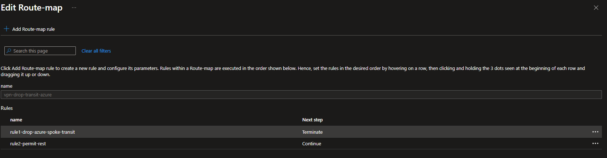
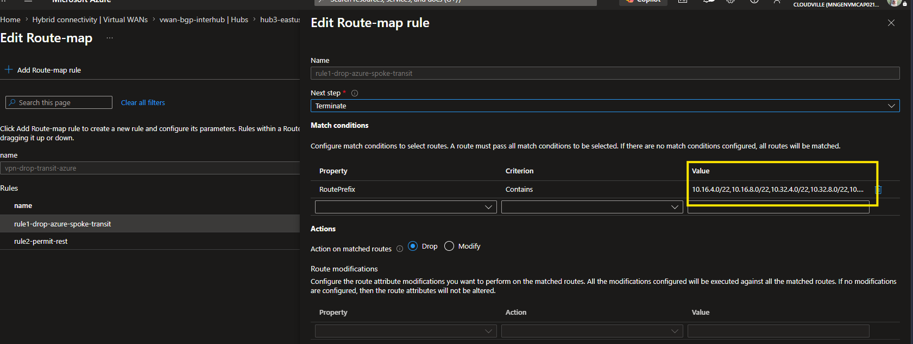
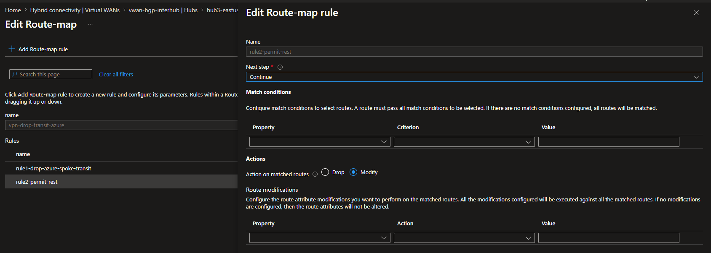
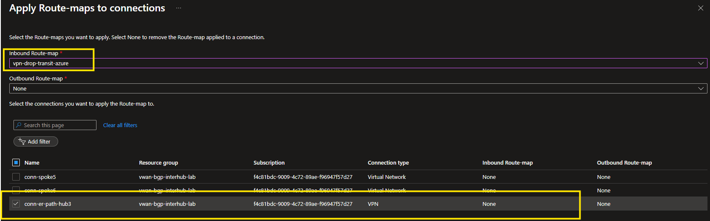
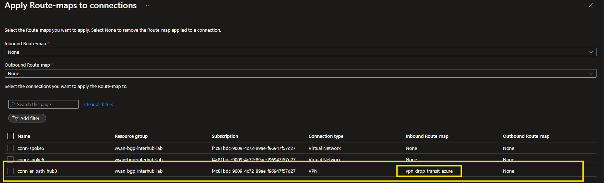

# Azure vWAN BGP Inter-Hub Routing Lab

Reproduces — and fixes — the **ExpressRoute inter-hub hairpin** in Azure Virtual WAN: when one ER circuit connects to multiple hubs, hub-to-hub traffic leaves the vWAN backbone and hairpins out through ER.

## Table of Contents

- [TL;DR](#tldr)
- [Architecture](#architecture)
- [Why Inter-Hub Traffic Hairpins](#why-inter-hub-traffic-hairpins)
- [The Solution — Route Maps](#the-solution--route-maps)
- [Mitigation Options Compared](#mitigation-options-compared)
- [Deployment](#deployment)
- [Lab Scenarios](#lab-scenarios)
- [PowerShell Scripts Reference](#powershell-scripts-reference)
- [Operations — Firewall Pause/Resume & Cost](#operations--firewall-pauseresume--cost)
- [Concepts, Related, References](#concepts-related-references)

## TL;DR

**Scenario:** a Virtual WAN with three hubs, all connected to a **single ExpressRoute circuit**. The circuit's MSEE reflects each hub's spoke prefixes to the other hubs, so every hub learns its siblings' spokes via its own (local) ER gateway. Because vWAN's route selection prefers **local gateway connections over inter-hub (Remote Hub) backbone routes** — and this happens at the *default* `ExpressRoute` Hub Routing Preference, with no setting changed — hub-to-hub traffic **hairpins out through ER** instead of staying on the vWAN backbone.

This lab reproduces that behavior using **VPN + FRR/strongSwan router** in place of the ER circuit (the FRR re-advertisement simulates MSEE route reflection), then demonstrates the fix: an inbound **Route Map** that keeps ER/VPN for on-prem connectivity but moves hub-to-hub back onto the backbone.

## Architecture

One on-prem edge (the ER mimic) peers IPsec + BGP to **all three** hub gateways — the faithful analog of a single ER circuit reaching three hubs. Each hub also reaches its siblings over the native vWAN backbone, so every cross-hub prefix has two candidate paths: gateway (hairpin) vs Remote Hub (backbone).


> **ER circuit simulation:** there's no real ER circuit — two FRR/strongSwan routers re-advertise each hub's spokes to the others (reflecting routes like an MSEE), so all three hubs hairpin. That simulation machinery — FRR transit config, tunnel/BGP verification, and command reference — lives in **[FRR Simulation](docs/frr-simulation.md)**. You don't need it to understand the Azure behavior or the fix.

Spoke prefixes, VM IPs, hub subnets, and connection names are labeled in the diagram above. On-prem is `10.0.0.0/16` (ASN `65001`).

## Why Inter-Hub Traffic Hairpins

When the same destination prefix is learned via both a local gateway (ER/VPN) and a Remote Hub, vWAN route selection runs: **(1)** Longest Prefix Match, **(2)** static over BGP, **(3)** *prefer routes from local hub connections over routes learned from a remote hub*, then the Hub Routing Preference tiebreak. Rule **(3)** fires **before** HRP — so a gateway-learned route beats the inter-hub backbone at the **default `ExpressRoute` HRP**, with nothing changed. That's why the customer hits it without touching any setting.

> Switching to `AS Path` HRP doesn't reliably fix it either — the gateway path can still be shorter than the inter-hub backbone (`65520 65520`), so it keeps winning. The durable fix is dropping the cross-hub prefixes at ingress, not tuning HRP. *(How the lab forces this with `as-path exclude`: [FRR Simulation](docs/frr-simulation.md).)*

**How the same thing happens in real environments:**

1. **No outbound route filtering** — the most common case. On-prem re-advertises everything it learns from one peer to all others; routes leak between hubs.
2. **SD-WAN overlays** (Viptela, Prisma, etc.) learn from one tunnel and propagate across the fabric, often not preserving AS-path (bypassing loop detection).
3. **Route redistribution** — BGP→OSPF→BGP toward a different hub loses the AS-path in the IGP hop.
4. **iBGP between on-prem routers**, each peered to a different hub.
5. **Static route redistribution** of Azure prefixes into BGP toward another hub.

> **ASN note for testing:** Azure Route Maps `Add asPath` rejects private (64512–65534) and reserved ASNs. Use documentation ASNs **64496–64511** ([RFC 5398](https://datatracker.ietf.org/doc/html/rfc5398)). The lab's peering ASN `65001` is valid for BGP but cannot be injected via Route Maps.

## The Solution — Route Maps

Stop the cross-hub spoke prefixes from being learned via the gateway, so each hub falls back to **Remote Hub** for inter-hub traffic — **while still using ER/VPN for genuine on-prem connectivity.** The tool is an **inbound Route Map** on each hub's ExpressRoute (or VPN) connection that drops the reflected Azure spoke prefixes and permits the real on-prem ranges. Each hub then has no local route for its siblings' spokes and uses the vWAN backbone; ER keeps carrying on-prem traffic untouched.

Two flavors (both HRP-independent — work at the default `ExpressRoute` HRP):

- **DROP — recommended ([Scenario 3](#3-apply-the-fix--route-maps-drop--filter)).** Deny the Azure spoke prefixes, permit everything else. In production, deny the **Azure supernet** (e.g. `10.16.0.0/12`) rather than each `/22`, so new spokes/hubs are auto-covered.
- **FILTER.** Permit only the on-prem ranges, deny all else (deny-by-default).

**Why DROP over FILTER:** the failure mode if the list is ever incomplete. With DROP, a forgotten Azure prefix merely hairpins again — *degraded routing*. With FILTER, a forgotten on-prem prefix is black-holed — *an outage*. Prefer the option whose mistake mode is degradation, not outage. Reserve FILTER for when you genuinely cannot enumerate on-prem ranges.

> **Operational reality:** the **first** Route Map on a hub triggers a one-time backend enablement that can take **up to 45 minutes** (the portal shows an empty grid the whole time — normal). Every subsequent map create/change/detach on that hub is fast. Plan the first rollout in a maintenance window.
>
> **Reference:** [How to configure Route Maps — Virtual WAN](https://learn.microsoft.com/azure/virtual-wan/route-maps-how-to) — supported actions (`Drop`, `Add`, `Replace`); Route Maps apply to ExpressRoute, VPN, and VNet connections.

## Mitigation Options Compared

| Method | Where | HRP Required | Granularity | Best For |
|--------|-------|-------------|-------------|---------|
| FRR `STANDARD_OUT` | On-prem router | Any | Per-peer | When you own the on-prem router |
| FRR `PREPEND4_OUT` | On-prem router | ASPath | Per-peer | Soft preference (on-prem keeps advertising) |
| Route Map Prepend (Scenario C) | Hub inbound | ASPath | Per-hub | On-prem can't change; AS-path tuning |
| **Route Map DROP (Scenario E)** | **Hub inbound** | **Any** | **Per-prefix** | **Recommended — clean fix with prefix list** |
| Route Map FILTER (Scenario F) | Hub inbound | Any | All inbound | Deny-by-default — strictest hub-side protection |

## Deployment

```powershell
# Clone
git clone https://github.com/colinweiner111/azure-vwan-bgp-interhub-lab.git
cd azure-vwan-bgp-interhub-lab

# Deploy (~30-45 min — 3 VPN Gateways deploy in parallel)
.\deploy-bicep.ps1 -ResourceGroupName vwan-bgp-interhub-lab -Location westus -Hub2Location westus3 -Hub3Location eastus2 -VpnPsk "YourPreSharedKey123!"

# Optional add-ons (append any combination):
#   -EnableBastion          VM access (adds ~5 min)
#   -EnableFirewall         Azure Firewall on all hubs (adds ~15 min)
#   -EnableFirewall -EnableRoutingIntent   Firewall + Routing Intent (adds ~20 min)
```

> Hub regions are customizable via `-Hub2Location` / `-Hub3Location`; hub names auto-generate from regions. `-EnableRoutingIntent` requires `-EnableFirewall`.

**Default credentials:** VM user `azureuser`; VM password prompted (or `-AdminPassword`); VPN PSK via `-VpnPsk`.

## Lab Scenarios

> All examples use `$rg = "vwan-bgp-interhub-lab"`. Allow ~60–90s for BGP reconvergence after any route change before validating. For FRR-side tunnel/BGP verification, see [FRR Simulation](docs/frr-simulation.md).

### 1. Verify cross-hub connectivity & read the path from TTL

Cross-hub traffic works either way — the **TTL reveals the path**, which is the most reliable signal when Routing Intent masks the effective-route table:

```bash
# From spoke1-vm (Hub1) → spoke3-vm (Hub2)
ping -c 5 10.32.4.10
```

| TTL observed | Path | Meaning |
|---|---|---|
| `ttl=61` | spoke → Hub GW → **FRR** → Hub GW → spoke | hairpin (gateway path) |
| `ttl=62` | spoke → Hub → **backbone** → Hub → spoke | fixed (Remote Hub) |

One extra TTL = one fewer L3 hop = the FRR hairpin removed. On-prem (`ping 10.0.0.10`) stays reachable in both states — the fix never touches on-prem.

### 2. Observe the hairpin (gateway override)

```powershell
# Hub1 should show Hub2/Hub3 spokes via VPN_S2S_Gateway instead of Remote Hub
az network vhub get-effective-routes -g $rg -n hub1-westus `
  --resource-type HubVirtualNetworkConnection `
  --resource-id (az network vhub connection show -g $rg --vhub-name hub1-westus -n conn-spoke1 --query id -o tsv) `
  | ConvertFrom-Json | Select-Object -ExpandProperty value | Format-Table
```

| Hub | Cross-hub prefix | Next-hop (hairpin) | Next-hop (fixed) |
|-----|------------------|--------------------|--------------------|
| Hub1 | `10.32.4.0/22`, `10.48.4.0/22` | `VPN_S2S_Gateway` | `Remote Hub` |
| Hub2 | `10.16.4.0/22`, `10.48.4.0/22` | `VPN_S2S_Gateway` | `Remote Hub` |
| Hub3 | `10.16.4.0/22`, `10.32.4.0/22` | `VPN_S2S_Gateway` | `Remote Hub` |

> **Routing Intent caveat:** with `-EnableRoutingIntent`, the hub effective-route table collapses to aggregates pointing at the firewall, so per-spoke next-hops are hidden. Use the **TTL method** (Scenario 1) to prove the flip in that case.

### 3. Apply the fix — Route Maps (DROP / FILTER)

```powershell
# DROP (recommended): drop cross-hub Azure spokes inbound on every hub's connection, permit on-prem
.\scripts\test-as-path-prepend.ps1 -Scenario E
Start-Sleep -Seconds 90
.\scripts\validate-routes.ps1
# Expected: cross-hub spokes → Remote Hub on all hubs; on-prem 10.0.0.0/16 stays VPN_S2S_Gateway

# FILTER (deny-by-default): permit only on-prem, drop all else inbound
.\scripts\test-as-path-prepend.ps1 -Scenario F

# Remove the route maps (revert to hairpin)
.\scripts\test-as-path-prepend.ps1 -Scenario D
```

Route-map logic — **DROP:** rule 1 matches the six `/22`s → `Drop` (Terminate); rule 2 → `Continue` (permits on-prem). **FILTER:** rule 1 permits `10.0.0.0/16` → Terminate; rule 2 → `Drop`.

#### Portal walkthrough (what the script builds)

The DROP route map `vpn-drop-transit-azure` has two rules — drop the transit spokes, permit the rest:



**Rule 1** (`rule1-drop-azure-spoke-transit`): match `RoutePrefix Contains` the six spoke `/22`s, action **Drop**, next step **Terminate**:



**Rule 2** (`rule2-permit-rest`): no match conditions (so it matches everything else — i.e. on-prem), next step **Continue** — i.e. permit:



Then **Apply Route-maps to connections** — set it as the **inbound** route map on the hub's `conn-er-path-*` connection. Note it's the **VPN/ER (branch) connection**, *not* the VNet/spoke connections (`conn-spoke*`):



After applying, the connection shows the inbound route map attached:



**Toggle one hub manually (portal or CLI)** to contrast a hairpinning hub against fixed ones — detach keeps the map resource so re-attach skips the 45-min creation:

```powershell
$rmId = az network vhub route-map show -g $rg --vhub-name hub1-westus --name vpn-drop-transit-azure --query id -o tsv
# Detach (revert Hub1 to hairpin):
az network vpn-gateway connection update -g $rg --gateway-name hub1-westus-vpngw --name conn-er-path --remove routingConfiguration.inboundRouteMap
# Re-attach (back to backbone):
az network vpn-gateway connection update -g $rg --gateway-name hub1-westus-vpngw --name conn-er-path --set routingConfiguration.inboundRouteMap.id=$rmId
```

### 4. Verify before/after (snapshot diff)

```powershell
.\scripts\compare-routes.ps1 -Snapshot -SnapshotFile before.json
.\scripts\test-as-path-prepend.ps1 -Scenario E ; Start-Sleep -Seconds 90
.\scripts\compare-routes.ps1 -Snapshot -SnapshotFile after.json
.\scripts\compare-routes.ps1 -Compare -Before before.json -After after.json
```

```
  --- Hub: hub1-westus ---
      10.16.4.0/22   HubVnetConnection   HubVnetConnection   unchanged
      10.32.4.0/22   VPN_S2S_Gateway     Remote Hub          IMPROVED (backbone restored)
      10.48.4.0/22   VPN_S2S_Gateway     Remote Hub          IMPROVED (backbone restored)
      10.0.0.0/16    VPN_S2S_Gateway     VPN_S2S_Gateway     unchanged
```

### 5. Alternative — Hub Routing Preference + AS-path prepend

HRP modes: `ExpressRoute` (default — gateway still beats Remote Hub), `VpnGateway` (gateway explicitly preferred), `ASPath` (shortest AS-path wins). With `ASPath`, restore the backbone by making the gateway path **longer** than `65520 65520`.

```powershell
.\scripts\set-hub-routing-preference.ps1 -ShowCurrent
.\scripts\set-hub-routing-preference.ps1 -Hub1 ASPath -Hub2 ASPath -Hub3 ASPath

# Azure-side prepend (RFC 5398 ASN 64496): C = 4x prepend → Remote Hub wins
.\scripts\test-as-path-prepend.ps1 -Scenario C    # A=none, B=2x (tie), C=4x, D=remove
```

| Scenario | Gateway AS-path | Remote Hub | Winner (HRP=ASPath) |
|----------|-----------------|------------|---------------------|
| A | `65001` | `65520 65520` | Gateway |
| B (2×) | `65001 64496 64496` | `65520 65520` | Remote Hub (tie-break) |
| C (4×) | `65001 64496 64496 64496 64496` | `65520 65520` | Remote Hub |

> The same prepend can be done **FRR-side** (on-prem, before advertising) via the `PREPEND2_OUT`/`PREPEND4_OUT` route-maps — see [FRR Simulation](docs/frr-simulation.md).

### 6. Full end-to-end test sequence

```powershell
.\scripts\validate-routes.ps1                                                  # baseline: hairpin
.\scripts\set-hub-routing-preference.ps1 -Hub1 ASPath -Hub2 ASPath -Hub3 ASPath
.\scripts\validate-routes.ps1                                                  # still hairpin (short path)
.\scripts\test-as-path-prepend.ps1 -Scenario C ; Start-Sleep -Seconds 90
.\scripts\validate-routes.ps1                                                  # Remote Hub wins (prepend)
.\scripts\test-as-path-prepend.ps1 -Scenario D
.\scripts\set-hub-routing-preference.ps1 -Hub1 ExpressRoute -Hub2 ExpressRoute -Hub3 ExpressRoute
.\scripts\validate-routes.ps1                                                  # back to baseline
```

### 7. Firewall path validation (`-EnableFirewall`)

```powershell
.\scripts\validate-routes.ps1   # Section 8 reports Routing Intent state per hub
az monitor log-analytics query `
  --workspace (az monitor log-analytics workspace list -g $rg --query "[0].customerId" -o tsv) `
  --analytics-query "AzureDiagnostics | where Category == 'AzureFirewallNetworkRule' | where TimeGenerated > ago(30m) | project TimeGenerated, msg_s | limit 20" -o table
```

With Routing Intent + transit both active, inter-hub flows are inspected by the firewall on each hub. The route-map fix changes the post-firewall next-hop (gateway → backbone) without disabling inspection.

## PowerShell Scripts Reference

| Script | Purpose |
|--------|---------|
| `deploy-bicep.ps1` | Deploy the full lab (~30-45 min) |
| `scripts/validate-routes.ps1` | Hub effective routes, BGP peers, next-hop analysis, Routing Intent |
| `scripts/test-as-path-prepend.ps1` | Inbound route maps: prepend (A/B/C), remove (D), DROP (E), FILTER (F) |
| `scripts/set-hub-routing-preference.ps1` | Toggle HRP per hub (ExpressRoute / VpnGateway / ASPath) |
| `scripts/compare-routes.ps1` | Snapshot effective routes to JSON and diff before/after |

```powershell
$rg = "vwan-bgp-interhub-lab"
.\scripts\validate-routes.ps1 -ResourceGroupName $rg      # core validation
.\scripts\validate-routes.ps1 -IncludeSpokeRoutes        # + spoke VM NIC routes (slower)
.\scripts\validate-routes.ps1 -IncludeFrrBgp             # + FRR BGP state (SSH)
.\scripts\set-hub-routing-preference.ps1 -ShowCurrent    # show HRP on all hubs
```

## Operations — Firewall Pause/Resume & Cost

When deployed with `-EnableFirewall`, the Hub-SKU firewalls can be deallocated to save cost and re-allocated later. The portal may still show a Public IP after deallocation — trust the attachment/state fields (`VirtualHub`, `IpConfigurations`, `ProvisioningState`), not the IP line. On `AnotherOperationInProgress (409)`, wait and retry (firewall ops are long-running).

```powershell
$rg = "vwan-bgp-interhub-lab"

# Deallocate all hub firewalls
Get-AzFirewall -ResourceGroupName $rg | ForEach-Object { $_.Deallocate(); Set-AzFirewall -AzureFirewall $_ | Out-Null }

# Re-allocate (re-attach each <hub-name>-azfw to its hub)
$hubs = @{}; Get-AzVirtualHub -ResourceGroupName $rg | ForEach-Object { $hubs[$_.Name] = $_ }
Get-AzFirewall -ResourceGroupName $rg | ForEach-Object {
   $fw = $_; $hubName = $fw.Name -replace '-azfw$',''
   $sub = New-Object Microsoft.Azure.Management.Network.Models.SubResource; $sub.Id = $hubs[$hubName].Id
   $fw.Allocate($sub); Set-AzFirewall -AzureFirewall $fw | Out-Null
}

# Verify
Get-AzFirewall -ResourceGroupName $rg | Select-Object Name, ProvisioningState,
  @{N='Hub';E={ ($_.VirtualHub.Id -split '/')[-1] }} | Format-Table -AutoSize
```

**Cost:** 3 vWAN VPN Gateways (~$2.17/hr total) + 9 B2s VMs + public IPs + hub fees ≈ **$3–4/hr base**; Bastion (~$0.26/hr) and Firewall (~$0.40/hr/hub) add more. VPN gateways can't be stopped — delete and redeploy to pause.

```powershell
az group delete -n vwan-bgp-interhub-lab --yes --no-wait
```

## Concepts, Related, References

**Demonstrated:** gateway-learned route precedence over Remote Hub; the "local connection beats remote hub" rule firing before HRP; per-hub/asymmetric BGP behavior; FRR route-maps controlling re-advertisement; Route Maps as the HRP-independent hub-side fix.

**Related:** [azure-vwan-vpn-failover](https://github.com/colinweiner111/azure-vwan-vpn-failover) — ER/VPN failover lab with LPM and Route Maps.

**References:**
[Hub Routing](https://learn.microsoft.com/azure/virtual-wan/about-virtual-hub-routing) ·
[Hub Routing Preference](https://learn.microsoft.com/azure/virtual-wan/about-virtual-hub-routing-preference) ·
[Route Maps How-To](https://learn.microsoft.com/azure/virtual-wan/route-maps-how-to) ·
[Route Maps About](https://learn.microsoft.com/azure/virtual-wan/route-maps-about) ·
[S2S VPN](https://learn.microsoft.com/azure/virtual-wan/virtual-wan-site-to-site-portal) ·
[FRRouting](https://docs.frrouting.org/) ·
[strongSwan](https://docs.strongswan.org/) ·
[RFC 5398](https://datatracker.ietf.org/doc/html/rfc5398)

MIT Licensed
